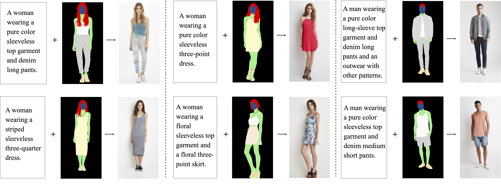
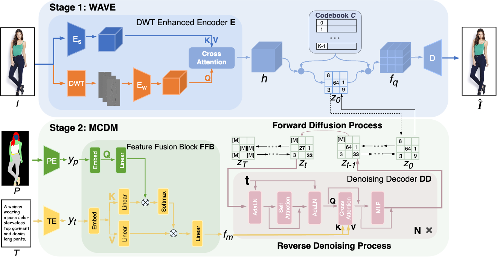

# Multi2Human
This repository provides the official PyTorch implementation for the following paper:

**Multi2Human: Controllable Human Image Generation with Multimodal Controls**</br>



## Abstract
>   *Generating high-quality and diverse human images presents a substantial difficulty within the field of computer vision, especially in developing controllable generative models that can utilize input from various modalities. Such models could enable innovative applications like digital human, fashion design, and content creation. In this study, we introduce Multi2Human, a two-stage image synthesis framework for controllable human image generation with multimodal controls. In the first stage, a novel WAvelet-vqVaE (WAVE) architecture is designed to embed human images using a learnable codebook. The WAVE model enhances the conventional Vector Quantized Variational Autoencoder (VQVAE) by integrating wavelets throughout the encoder, thereby enhancing the quality of image reconstruction and synthesis. In the second stage, a new Multimodal Conditioned Diffusion Model (MCDM) is de- signed to estimate the underlying prior distribution within the discrete latent space using a discrete diffusion process, thus allowing for human image generation condi- tioned on multimodal controls. Quantitative and qualitative analysis demonstrates that the proposed method has the ability to create high-quality, lifelike full-body human images while satisfying the specified multimodal controls.*



## Setup

**Clone this repo:**
```bash
git clone https://github.com/gxl-groups/Multi2Human.git
cd Multi2Human
```

**Dependencies:**

```bash
conda create --name multi2Human --file requirements.yml
conda activate multi2Human
```

### Dataset Preparation
[Click here!](https://github.com/yumingj/Text2Human#1-dataset-preparation)

### Pre-Trained Models
Pre-trained models can be found [here](xxxx).

## Implementation

### Training StageI (A variant of VQGAN model called WAVE.)
```
python3 train_vqgan.py --dataset Deepfashion --log_dir vqgan_fashion --batch_size 4 --amp --ema 
```
### Testing StageI
```
python test.py --dataset DeepfashionT --ae_load_step 900000 --ae_load_dir vqgan_fashion --sampler absorbing --batch_size 1   --ema --amp
```
The reconstruction results will be saved to the directory `logs/vqgan_fashion`. This includes all logs, model checkpoints and saved outputs.

### Training StageII (A variant of VQ-Diffusion model called MCDM.)
```
python3 train_stage2.py --sampler absorbing --dataset Deepfashion --log_dir absorbing_fashion --ae_load_dir vqgan_fashion --ae_load_step 900000 --amp --ema --batch_size 4
```
### Sampling StageII
```
python3 test_stage2.py --sampler absorbing --dataset DeepfashionT --log_dir absorbing_fashion --ae_load_dir vqgan_fashion --ae_load_step 900000 --amp --load_dir absorbing_fashion --load_step 250000 --ema --batch_size 1
```
The final results will be saved to the directory `logs/absorbing_fashion`. This includes all logs, model checkpoints and saved outputs.
